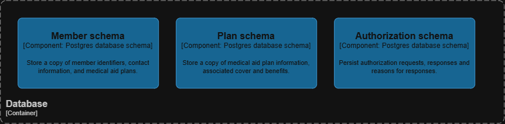

# Context Diagrams

This project will be a simplified extrapolation on hospital cover and processes according to (at a very high level) detailed provided on this website:
[Hospital Cover Example](https://www.discovery.co.za/portal/medical-aid/going-to-hospital)

## System Context 

## Containers

## Components

## Code

# Supporting Diagrams

## System Landscape

## Dynamic Diagrams

## Deployment Diagram